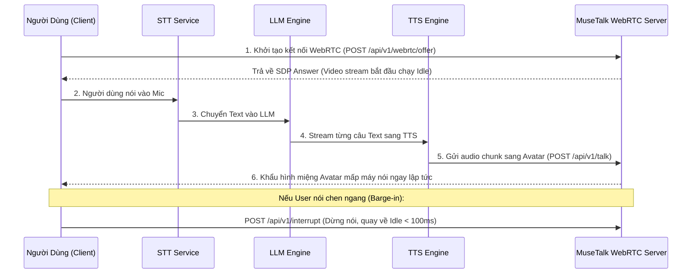

# 🚀 Hướng Dẫn Triển Khai MuseTalk Live Avatar API Trên IBM Cloud GPU

Tài liệu này hướng dẫn chi tiết cách triển khai hệ thống **Live Avatar Real-Time** từ mã nguồn này lên máy chủ GPU của **IBM Cloud** bằng Docker, sau đó kết nối vào pipeline **STT - LLM - TTS** của bạn.

---

## 📑 Mục Lục
1. [Khởi tạo Máy Chủ Trên IBM Cloud](#1-khởi-tạo-máy-chủ-trên-ibm-cloud)
2. [Cài đặt Môi trường GPU Tự Động](#2-cài-đặt-môi-trường-gpu-tự-động)
3. [Khởi Chạy Dịch Vụ Live Avatar](#3-khởi-chạy-dịch-vụ-live-avatar)
4. [Truy cập Web Console Để Thử Nghiệm](#4-truy-cập-web-console-để-thử-nghiệm)
5. [Tích Hợp API Vào Pipeline STT - LLM - TTS](#5-tích-hợp-api-vào-pipeline-stt---llm---tts)
6. [Quản Lý & Tiền Xử Lý Avatar Mới](#6-quản-lý--tiền-xử-lý-avatar-mới)

---

## 1. Khởi tạo Máy Chủ Trên IBM Cloud

1. **Đăng nhập IBM Cloud Console** $\rightarrow$ Vào mục **VPC Infrastructure** $\rightarrow$ **Virtual Server Instances**.
2. **Chọn Cấu hình**:
   * **Hệ điều hành**: `Ubuntu 22.04 LTS x86_64`.
   * **Profile GPU**:
     * Khuyến nghị: **NVIDIA L4 / L40S** (Ada Lovelace, tối ưu chi phí và hiệu năng) hoặc **NVIDIA A100 / V100**.
   * **Dung lượng ổ đĩa (Boot Storage)**: Tối thiểu **100 GB** SSD.
3. **Mở Cổng Firewall (Security Group)**:
   * `8000` (TCP) - Cổng dịch vụ FastAPI & Web Console.
   * `80`, `443` (TCP) - Cổng HTTP / HTTPS.
   * `10000-20000` (UDP) - Dải cổng truyền luồng video/audio WebRTC.
   * `3478` (TCP/UDP) - Cổng STUN/TURN (nếu dùng Coturn).

---

## 2. Cài đặt Môi trường GPU Tự Động

Sau khi máy chủ khởi động, SSH vào server bằng terminal của bạn:

```bash
ssh root@<IP_PUBLIC_IBM_CLOUD>
```

Đẩy mã nguồn repo này lên server (hoặc clone từ Git repo của bạn):
```bash
git clone <URL_REPO_CUA_BAN> MuseTalk
cd MuseTalk
```

Chạy script cài đặt tự động toàn bộ NVIDIA Driver, Docker và NVIDIA Container Toolkit:
```bash
chmod +x deploy/setup_ibm_cloud.sh
bash deploy/setup_ibm_cloud.sh
```

---

## 3. Khởi Chạy Dịch Vụ Live Avatar

Khởi động hệ sinh thái container dịch vụ thông qua Docker Compose:

```bash
docker compose up -d --build
```

Container sẽ tự động:
1. Tải toàn bộ bộ trọng số mô hình (`models/musetalkV15`, `sd-vae`, `whisper-tiny`, `dwpose`) nếu chưa có sẵn.
2. Nạp mô hình UNet và VAE lên VRAM GPU ở chế độ `FP16`.
3. Mở API Server tại cổng `8000`.

Xem nhật ký log hoạt động:
```bash
docker logs -f musetalk-realtime
```

---

## 4. Truy cập Web Console Để Thử Nghiệm

Mở trình duyệt trên máy tính cá nhân của bạn và truy cập:
```text
http://<IP_PUBLIC_IBM_CLOUD>:8000
```

Tại giao diện Web Console:
* Bấm **▶ Bắt Đầu Kết Nối WebRTC**: Video avatar sẽ phát trực tiếp vòng lặp Idle (thở nhẹ/chớp mắt tự nhiên).
* Bấm **📁 Chọn File Audio & Gửi** hoặc **🎙️ Thu Âm Từ Micro**: Avatar sẽ nhép miệng chính xác theo âm thanh gửi đến.
* Bấm **⚡ Ngắt Lời (Barge-in)**: Kiểm tra tính năng ngắt lời tức thì khi bot đang nói.

---

## 5. Tích Hợp API Vào Pipeline STT - LLM - TTS

### Sơ đồ Luồng Tích Hợp:


### Mã Python Mẫu Kết Nối TTS sang MuseTalk:

```python
import requests

SERVER_URL = "http://<IP_PUBLIC_IBM_CLOUD>:8000"
SESSION_ID = "<SESSION_ID_TU_WEBRTC>"

def send_tts_audio_to_avatar(audio_bytes: bytes):
    """
    Gửi luồng âm thanh từ TTS sang Avatar để bắt đầu nhép miệng.
    """
    files = {
        "audio_file": ("chunk.wav", audio_bytes, "audio/wav")
    }
    data = {
        "session_id": SESSION_ID
    }
    response = requests.post(f"{SERVER_URL}/api/v1/talk", data=data, files=files)
    return response.json()

def interrupt_avatar():
    """
    Ngắt lời bot khi người dùng nói chen ngang.
    """
    response = requests.post(f"{SERVER_URL}/api/v1/interrupt", json={"session_id": SESSION_ID})
    return response.json()
```

---

## 6. Quản Lý & Tiền Xử Lý Avatar Mới

Để thêm một nhân vật Avatar mới vào hệ thống:
1. Chuẩn bị 1 video ngắn 5–10 giây, định dạng `.mp4`, chuẩn **25 FPS**.
2. Gọi API để server tự động tiền xử lý (pre-caching):
   ```bash
   curl -X POST "http://<IP_PUBLIC_IBM_CLOUD>:8000/api/v1/avatars/prepare" \
     -F "avatar_id=my_avatar" \
     -F "video_file=@/path/to/avatar_video.mp4" \
     -F "bbox_shift=0" \
     -F "parsing_mode=jaw"
   ```
3. Sau khi hoàn tất, avatar mới sẽ xuất hiện trong danh sách `GET /api/v1/avatars` và sẵn sàng phát trực tiếp ngay lập tức!
